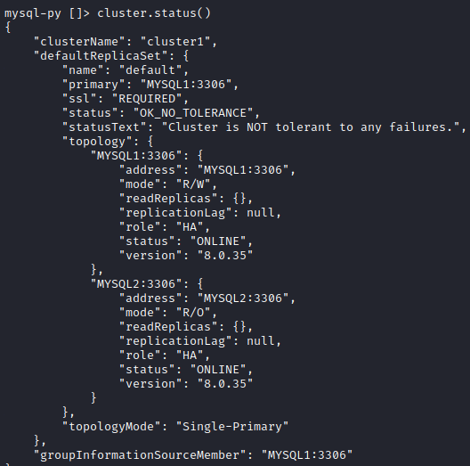

# TP Loadbalancing

## Introduction

### L'objectif

L’objectif de ce TP est d’étudier et de mettre en place l’application web Nextcloud (https://nextcloud.com/) de manière à la rendre hautement disponible. Par hautement disponible, vous devez bien évidemment entendre tolérance de panne et répartition de charge.

En effet, l’application doit tolérer la perte de n’importe quel équipement matériel sans engendrer de coupure de service.

De plus l’application doit pouvoir s’adapter, sans changement d’architecture majeure, à une augmentation de la charge (nombre de connexions clientes importantes). Votre travail devra faire apparaître tous les éléments matériels nécessaires ainsi que les composants logiciels à mettre en place. Toutes les solutions techniques sont envisageables à partir du moment où elles répondent aux contraintes de haute disponibilité. 

Afin de rendre un travail complet, vous vous attacherez à prendre en compte tous les composants importants pour cette application :
• Frontal http / https
• Gestion des sessions de connexion
• Gestion du stockage de fichiers
• Gestion de la base de données

### L'infrastructure

Tout d'abord notre infrastucture sera dans le réseau 10.0.2.0/24. Nous aurons un client avec l'IP 10.0.2.100/24, qui accèdera au LOAD Balancer HaPROXY qui aura pour role répartir le trafic entrant sur deux serveurs HTTP hébergeant NextCloud, garantissant ainsi une distribution équilibrée de la charge, une meilleure disponibilité, et une haute fiabilité des applications. 

Ce HA Proxy repartira la charge entre deux serveurs Apache en 10.0.2.21/24 et 10.0.2.22/24. Nous installerons sur ces deux serveurs le service Nextcloud qui est une plateforme de collaboration en ligne open source permettant de stocker, partager et accéder à des fichiers, ainsi que d'intégrer des applications telles que le calendrier et la messagerie. Pour faire fonctionné ce service nous avons besoin d'une base de donnée MariaDB SQL ainsi qu'un espace de stockage. 

Pour la base de donnée nous allons mettre en place un Cluster Innodb avec un router MySQL (MYSQLRT - 10.0.2.30/24) avec deux serveurs BDD (MariaDB) en 10.0.2.31/24 et 10.0.2.32/24. 

Pour la partie stockage nous allons mettre en place un stockage GlusterFS Actif/Passif qui est une configuration où deux nœuds de stockage fonctionnent en mode actif et passif, assurant une haute disponibilité et la reprise sur incident en cas de défaillance d'un nœud, avec deux serveurs en 10.0.2.41/24 et 10.0.2.42/24.


## Mise en place

### Configuration MYSQL

Tout d'abord nous configurons notre interface réseau en IP fixe

```bash
# nano /etc/netplan/00-installer-config.yaml

network:
  ethernets:
    enp0s3:
      addresses:
        - 10.0.2.31/24
      routes:
        - to: default
          via: 10.0.2.1
      nameservers:
        addresses:
          - 8.8.8.8
          - 1.1.1.1
      dhcp4: false
  version: 2
```

Nous changeons ensuite notre fichier host afin que nos serveurs communiquent plus simplement entre eux :


Nous pouvons enfin commencer à installer MySQL :

```bash
apt install mysql-server 
snap install mysql-shell 
# Remplacer bind-address = 127.0.0.1 par bind-address = 0.0.0.0 dans le fichier /etc/mysql/mysql.conf.d/mysqld.cnf

systemctl restart mysql.service
```

Nous mettons en place le cluster en faisant les commandes suivante sur les deux noeuds pour créer un admin remote sur chaque node :

```bash
mysql -p
CREATE USER 'admin'@'%' IDENTIFIED BY 'admin'; 
GRANT ALL PRIVILEGES ON *.* TO 'admin'@'%' WITH GRANT OPTION; 
FLUSH PRIVILEGES;
```

Depuis MYSQL1 :

```bash
mysqlsh 
dba.configure_instance('admin@MYSQL1') 
dba.configure_instance('admin@MYSQL2') 

\c admin@MYSQL1
cluster = dba.create_cluster('cluster1') 
cluster.status()

// Ajout des nodes en mode clone 
cluster.add_instance('admin@MYSQL2')  
```



Sur le MYSQLRT :

```bash
wget https://dev.mysql.com/get/mysql-apt-config_0.8.25-1_all.deb 
dpkg -i mysql-apt-config_0.8.25-1_all.deb 
apt update 
apt install mysql-router mysql-shell mysql-client 

mysqlrouter --bootstrap admin@MYSQL1 --user=root --directory  /etc/innodbcluster1
```
